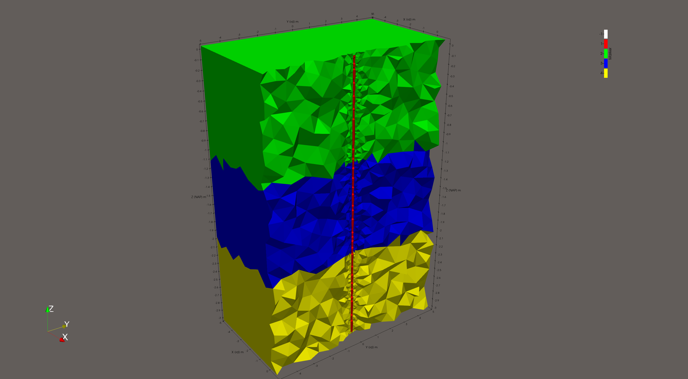

# PyBorehole ERT Simulator

PyBorehole is a Python-based utility designed to define geometries, generate meshes, and simulate 3D Electrical Resistivity Tomography (ERT) measurements tailored for borehole and cross-hole environments. It leverages the **PyGIMLi** framework for robust finite-element forward modeling and **PyVista** / Matplotlib for visualizations.

## Features

- **1D Layered Earth Generation**: Easily define multiple soil layer boundaries with customized resistivity values dynamically integrated into the 3D model.
- **Borehole Fluid Integration**: Explicitly models the borehole cylinder with its own target tetrahedra resolution and specific fluid resistivity (e.g., highly conductive fluid).
- **Custom ERT Array Protocol**: Programmatically builds measurement protocols (e.g., Wenner) mapping down the borehole length natively into the mesh structure.
- **Mesh Area Constraints**: Controls mesh quality heavily around structural nodes (electrodes, inner core, and outer world boundary) strictly matching physics demands.
- **Simulation & Results**: Solves the forward model (ERT) resolving accurate apparent resistivities and visualizing the responses structurally against the domain.

## Workflow

1. Configure a `Geometry` data class setting up boundary boxes and layer depths.
2. Establish a Piecewise Linear Complex (PLC) generating proper finite boundary conditions (Robin/Mixed).
3. Generate dynamic electrode structures tied as exact nodes for the `pygimli` mesh generators.
4. Process the Finite Element simulation with `ert.simulate()`.
5. Visualize 2D slice matrices and depth profile charts directly outlining model responses.

## Visualizing the Results

### 2D Model Slice & Depth Profile
Below is the standard dual-view Matplotlib output, displaying a slice of the 1D Layer model highlighting the localized highly conductive borehole. On the right, the apparent resistivity profiles reflect short spacing vs. long spacing protocols measuring through those boundary limits.


### 3D Resistivity Mesh View
Below is a visual representation of the highly resolved inner core mesh accurately mapped with distinct resistivity volumes conforming structurally around the borehole interfaces.



### Demo & Usage
To try out and interact with this package, you can use the demo.ipynb Jupyter Notebook included in this repository.

Note: The demo.ipynb file is currently a work in progress, but it provides a great starting point to see how to configure the geometry, run the mesh generator, and plot the simulated ERT data.

## Installation & Requirements

To run this package, you will need to install the dependencies outlined in `requirements.txt`.

```bash
pip install -r requirements.txt
```